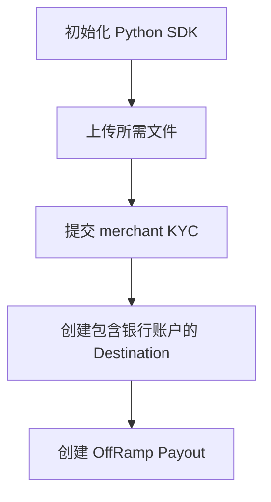

本指南介绍如何使用 Cobo WaaS 2.0 Python SDK（`cobo_waas2`）集成第三方资金转出流程。该流程包括 SDK 初始化、上传所需文件、提交 merchant KYC、创建包含银行账户的 Destination，以及创建 OffRamp Payout。

SDK 安装和基础配置请参阅 [Python SDK 快速入门](/payments/cn/developer-tools/quickstart-python)。OffRamp Payout、Destination 和商户管理的行为说明，请参阅 [Off-Ramp 对接](/payments/cn/guides/fiat-payouts)、[转出目的地](/payments/cn/guides/destinations)和[商户管理](/payments/cn/guides/merchants)。

## 前提条件

- 按照 [Python SDK 快速入门](/payments/cn/developer-tools/quickstart-python)安装并配置 Python SDK。
- 创建或确定需要提交 KYC 信息的商户。商户配置概念请参阅[商户管理](/payments/cn/guides/merchants)。
- 准备 merchant KYC 和银行账户绑定所需的本地文件。
- 准备 OffRamp Payout 使用的目标银行账户信息。

## 初始化 Python SDK

创建 `Configuration` 对象并传入 API 私钥和 API host，然后实例化 `PaymentApi`。

```python
import cobo_waas2
from cobo_waas2 import ApiClient
from cobo_waas2.api.payment_api import PaymentApi

configuration = cobo_waas2.Configuration(
    api_private_key="your_api_private_key",
    host="https://api.sandbox.cobo.com/v2",
)
api_client = ApiClient(configuration)
api_instance = PaymentApi(api_client)
```

## 集成流程



## 上传所需文件

使用 `upload_payment_file_v2` 上传后续 API 操作所需的本地文件，例如 merchant KYC 附件或银行账户绑定合同文件。API 返回的 `file_id` 可用于后续请求。

API 操作：[Upload file V2](/payments/en/api-references/payment/upload-file-v2)。

```python
import base64
import os

from cobo_waas2.models.payment_upload_file_v2 import PaymentUploadFileV2


def create_file(file_path: str):
    with open(file_path, "rb") as f:
        file_bytes = f.read()
    file_content = base64.b64encode(file_bytes).decode("ascii")
    print(f"file size = {len(file_bytes)} bytes")
    print(f"file_content size = {len(file_content)} bytes")
    response = api_instance.upload_payment_file_v2(
        payment_upload_file_v2=PaymentUploadFileV2(
            file_name=os.path.basename(file_path),
            file_content=file_content,
        )
    )
    print(response)
    return response
```

## 提交 merchant KYC

使用 `submit_merchant_kyc` 为商户提交 KYC 信息。以下示例提交 B2B 商户信息、公司注册信息、公司附件、法人信息和最终受益人信息。

API 操作：[Submit merchant KYC](/payments/en/api-references/payment/submit-merchant-kyc)。

```python
from cobo_waas2.models.merchant_kyc_address import MerchantKycAddress
from cobo_waas2.models.merchant_kyc_company_attachment import MerchantKycCompanyAttachment
from cobo_waas2.models.merchant_kyc_company_attachment_file_type import MerchantKycCompanyAttachmentFileType
from cobo_waas2.models.merchant_kyc_company_info import MerchantKycCompanyInfo
from cobo_waas2.models.merchant_kyc_company_type import MerchantKycCompanyType
from cobo_waas2.models.merchant_kyc_merchant_type import MerchantKycMerchantType
from cobo_waas2.models.merchant_kyc_person_attachment import MerchantKycPersonAttachment
from cobo_waas2.models.merchant_kyc_person_attachment_file_type import MerchantKycPersonAttachmentFileType
from cobo_waas2.models.merchant_kyc_person_info import MerchantKycPersonInfo
from cobo_waas2.models.submit_merchant_kyc import SubmitMerchantKyc


def submit_merchant_kyc():
    file_id = "3b6f1f01-ddb8-4f9d-9966-80a984ce0fa6"
    card_front_file_id = "e86bd83f-c789-4413-8bac-017babfce81e"
    card_back_file_id = "0bfd3230-0f0c-40ea-a27a-7717dd6d2413"
    fic_file_id = "3d0ac098-4983-4cb2-9dc9-2567ca00be61"
    response = api_instance.submit_merchant_kyc(
        merchant_id="M1001",
        submit_merchant_kyc=SubmitMerchantKyc(
            merchant_type=MerchantKycMerchantType.B2B,
            country="HKG",
            industry=["Tangibles Goods", "Automotive"],
            company_info=MerchantKycCompanyInfo(
                company_type=MerchantKycCompanyType.LIMITED_COMPANY,
                listed=False,
                attachments=[
                    MerchantKycCompanyAttachment(
                        file_id=file_id,
                        file_type=MerchantKycCompanyAttachmentFileType.CI,
                    ),
                    MerchantKycCompanyAttachment(
                        file_id=file_id,
                        file_type=MerchantKycCompanyAttachmentFileType.BR,
                    ),
                    MerchantKycCompanyAttachment(
                        file_id=file_id,
                        file_type=MerchantKycCompanyAttachmentFileType.NNC1,
                    ),
                    MerchantKycCompanyAttachment(
                        file_id=file_id,
                        file_type=MerchantKycCompanyAttachmentFileType.ANNUAL_RETURN,
                    ),
                    MerchantKycCompanyAttachment(
                        file_id=file_id,
                        file_type=MerchantKycCompanyAttachmentFileType.AOA,
                    ),
                    MerchantKycCompanyAttachment(
                        file_id=file_id,
                        file_type=MerchantKycCompanyAttachmentFileType.BAP,
                    ),
                    MerchantKycCompanyAttachment(
                        file_id=file_id,
                        file_type=MerchantKycCompanyAttachmentFileType.SSC,
                    ),
                ],
                operation_address=MerchantKycAddress(
                    country="HKG",
                    state="New Territories",
                    city="大埔区",
                    postcode="999077",
                    line1="Unit 1408, 14/F, Tai Po Mega Mall, 9 On Pong Road, Tai Po",
                ),
                identify_no="91736482-000-11-25-A",
                company_name="領峰汽車零件有限公司",
                company_name_en="Peakway Auto Parts Limited",
                establish_date="20130916",
                commencement_date="20131008",
                valid_period="20280916",
                register_address=MerchantKycAddress(
                    country="HKG",
                    state="Hong Kong Island",
                    city="中西区",
                    postcode="999077",
                    line1="Room 905, 9/F, Jardine House, 1 Connaught Place, Central",
                ),
                legal_info=MerchantKycPersonInfo(
                    name="鄧啟明",
                    name_en="TANG KAI MING",
                    attachments=[
                        MerchantKycPersonAttachment(
                            file_id=card_front_file_id,
                            file_type=MerchantKycPersonAttachmentFileType.HK_PID,
                        ),
                        MerchantKycPersonAttachment(
                            file_id=card_back_file_id,
                            file_type=MerchantKycPersonAttachmentFileType.BACK,
                        ),
                        MerchantKycPersonAttachment(
                            file_id=fic_file_id,
                            file_type=MerchantKycPersonAttachmentFileType.FIC,
                        ),
                    ],
                    id_number="K582047(5)",
                    date_of_birth="19810914",
                    issue_date="20170914",
                    expiration_date="20270914",
                    residential_address=MerchantKycAddress(
                        country="HKG",
                        state="New Territories",
                        city="元朗区",
                        postcode="999077",
                        line1="Flat 8A, Block 3, Kingswood Villas, 1 Tin Shui Road, Tin Shui Wai",
                    ),
                ),
                ubo_infos=[
                    MerchantKycPersonInfo(
                        name="何嘉欣",
                        name_en="HO KA YAN",
                        attachments=[
                            MerchantKycPersonAttachment(
                                file_id=card_front_file_id,
                                file_type=MerchantKycPersonAttachmentFileType.HK_PID,
                            ),
                            MerchantKycPersonAttachment(
                                file_id=card_back_file_id,
                                file_type=MerchantKycPersonAttachmentFileType.BACK,
                            ),
                            MerchantKycPersonAttachment(
                                file_id=fic_file_id,
                                file_type=MerchantKycPersonAttachmentFileType.FIC,
                            ),
                        ],
                        id_number="M916384(2)",
                        date_of_birth="19900326",
                        issue_date="20180326",
                        expiration_date="20280326",
                        residential_address=MerchantKycAddress(
                            country="HKG",
                            state="New Territories",
                            city="西贡区",
                            postcode="999077",
                            line1="Flat 21D, Tower 2, Lohas Park Phase 3, 1 Lohas Park Road, Tseung Kwan O",
                        ),
                    ),
                ],
                online_store_url="https://www.peakway-autoparts.hk",
            ),
        ),
    )
    print(response)
    return response
```

## 创建包含银行账户的 Destination

使用 `create_destination` 创建包含收款银行账户的 Destination，用于 OffRamp Payout。Destination 的概念说明请参阅[转出目的地](/payments/cn/guides/destinations)。

API 操作：[Create destination](/payments/en/api-references/payment/create-destination)。

```python
from cobo_waas2.models.bank_account_holder_type import BankAccountHolderType
from cobo_waas2.models.bank_account_payment_method import BankAccountPaymentMethod
from cobo_waas2.models.create_destination_bank_account import CreateDestinationBankAccount
from cobo_waas2.models.create_destination_request import CreateDestinationRequest
from cobo_waas2.models.destination_type import DestinationType


def create_bank_account():
    response = api_instance.create_destination(
        create_destination_request=CreateDestinationRequest(
            destination_name="Peakway Auto Parts USD payout",
            destination_type=DestinationType.ORGANIZATION,
            bank_accounts=[
                CreateDestinationBankAccount(
                    account_alias="peakway-autoparts-hangseng-usd",
                    account_number="0247518362940",
                    swift_code="HASEHKHHXXX",
                    currency="USD",
                    beneficiary_name="Peakway Auto Parts Limited",
                    beneficiary_address="Unit 1408, 14/F, Tai Po Mega Mall, 9 On Pong Road, Tai Po",
                    bank_name="HANG SENG BANK LIMITED",
                    bank_address="83 Des Voeux Road Central, Central, Hong Kong",
                    iban_code="HK024751836294012345",
                    country="HKG",
                    city="Tai Po District",
                    payment_method=BankAccountPaymentMethod.SWIFT,
                    holder_type=BankAccountHolderType.COMPANY,
                    beneficiary_province="New Territories",
                    beneficiary_post_code="999077",
                    bank_account_name="Peakway Auto Parts Limited",
                    bank_branch_code="024",
                    bank_country="HKG",
                    bank_province="Hong Kong Island",
                    bank_city="Central and Western District",
                    contract_file_id="3d0ac098-4983-4cb2-9dc9-2567ca00be61",
                )
            ],
            merchant_id="M1008",
            country="HKG",
            email="finance@peakway-autoparts.hk",
            contact_address="Unit 1408, 14/F, Tai Po Mega Mall, 9 On Pong Road, Tai Po",
        )
    )
    print(response)
    return response
```

## 创建 OffRamp Payout

使用 `create_payout` 提交资金转出请求。将 `payout_channel` 设置为 `PayoutChannel.OFFRAMP`，在 `request_id` 中传入客户端生成的 UUID，在 `source_account` 中指定资金来源商户，并在 `recipient_info.bank_account_id` 中传入目标银行账户 ID。

API 操作：[Create payout](/payments/en/api-references/payment/create-payout)。

```python
import uuid

from cobo_waas2.models.create_payout_request import CreatePayoutRequest
from cobo_waas2.models.payment_payout_param import PaymentPayoutParam
from cobo_waas2.models.payment_payout_recipient_info import PaymentPayoutRecipientInfo
from cobo_waas2.models.payout_channel import PayoutChannel


def create_payout():
    response = api_instance.create_payout(
        create_payout_request=CreatePayoutRequest(
            request_id=str(uuid.uuid4()),
            payout_channel=PayoutChannel.OFFRAMP,
            source_account="M1001",
            payout_params=[
                PaymentPayoutParam(
                    token_id="TTRON_USDT",
                    amount="90",
                )
            ],
            remark="test",
            recipient_info=PaymentPayoutRecipientInfo(
                currency="USD",
                bank_account_id="47de9ef9-2c73-4dd8-ae6c-467a0258ca58",
            ),
        )
    )
    print(response)
    return response
```

## 完整代码示例

```python
import base64
import os
import uuid

import cobo_waas2
from cobo_waas2 import ApiClient
from cobo_waas2.api.payment_api import PaymentApi
from cobo_waas2.models.bank_account_holder_type import BankAccountHolderType
from cobo_waas2.models.bank_account_payment_method import BankAccountPaymentMethod
from cobo_waas2.models.create_destination_bank_account import CreateDestinationBankAccount
from cobo_waas2.models.create_destination_request import CreateDestinationRequest
from cobo_waas2.models.create_payout_request import CreatePayoutRequest
from cobo_waas2.models.destination_type import DestinationType
from cobo_waas2.models.merchant_kyc_address import MerchantKycAddress
from cobo_waas2.models.merchant_kyc_company_attachment import MerchantKycCompanyAttachment
from cobo_waas2.models.merchant_kyc_company_attachment_file_type import MerchantKycCompanyAttachmentFileType
from cobo_waas2.models.merchant_kyc_company_info import MerchantKycCompanyInfo
from cobo_waas2.models.merchant_kyc_company_type import MerchantKycCompanyType
from cobo_waas2.models.merchant_kyc_merchant_type import MerchantKycMerchantType
from cobo_waas2.models.merchant_kyc_person_attachment import MerchantKycPersonAttachment
from cobo_waas2.models.merchant_kyc_person_attachment_file_type import MerchantKycPersonAttachmentFileType
from cobo_waas2.models.merchant_kyc_person_info import MerchantKycPersonInfo
from cobo_waas2.models.payment_payout_param import PaymentPayoutParam
from cobo_waas2.models.payment_payout_recipient_info import PaymentPayoutRecipientInfo
from cobo_waas2.models.payment_upload_file_v2 import PaymentUploadFileV2
from cobo_waas2.models.payout_channel import PayoutChannel
from cobo_waas2.models.submit_merchant_kyc import SubmitMerchantKyc


configuration = cobo_waas2.Configuration(
    api_private_key="your_api_private_key",
    host="https://api.sandbox.cobo.com/v2",
)
api_client = ApiClient(configuration)
api_instance = PaymentApi(api_client)


def create_file(file_path: str):
    with open(file_path, "rb") as f:
        file_bytes = f.read()
    file_content = base64.b64encode(file_bytes).decode("ascii")
    response = api_instance.upload_payment_file_v2(
        payment_upload_file_v2=PaymentUploadFileV2(
            file_name=os.path.basename(file_path),
            file_content=file_content,
        )
    )
    print(response)
    return response


def submit_merchant_kyc():
    file_id = "3b6f1f01-ddb8-4f9d-9966-80a984ce0fa6"
    card_front_file_id = "e86bd83f-c789-4413-8bac-017babfce81e"
    card_back_file_id = "0bfd3230-0f0c-40ea-a27a-7717dd6d2413"
    fic_file_id = "3d0ac098-4983-4cb2-9dc9-2567ca00be61"
    response = api_instance.submit_merchant_kyc(
        merchant_id="M1001",
        submit_merchant_kyc=SubmitMerchantKyc(
            merchant_type=MerchantKycMerchantType.B2B,
            country="HKG",
            industry=["Tangibles Goods", "Automotive"],
            company_info=MerchantKycCompanyInfo(
                company_type=MerchantKycCompanyType.LIMITED_COMPANY,
                listed=False,
                attachments=[
                    MerchantKycCompanyAttachment(file_id=file_id, file_type=MerchantKycCompanyAttachmentFileType.CI),
                    MerchantKycCompanyAttachment(file_id=file_id, file_type=MerchantKycCompanyAttachmentFileType.BR),
                    MerchantKycCompanyAttachment(file_id=file_id, file_type=MerchantKycCompanyAttachmentFileType.NNC1),
                    MerchantKycCompanyAttachment(file_id=file_id, file_type=MerchantKycCompanyAttachmentFileType.ANNUAL_RETURN),
                    MerchantKycCompanyAttachment(file_id=file_id, file_type=MerchantKycCompanyAttachmentFileType.AOA),
                    MerchantKycCompanyAttachment(file_id=file_id, file_type=MerchantKycCompanyAttachmentFileType.BAP),
                    MerchantKycCompanyAttachment(file_id=file_id, file_type=MerchantKycCompanyAttachmentFileType.SSC),
                ],
                operation_address=MerchantKycAddress(
                    country="HKG",
                    state="New Territories",
                    city="大埔区",
                    postcode="999077",
                    line1="Unit 1408, 14/F, Tai Po Mega Mall, 9 On Pong Road, Tai Po",
                ),
                identify_no="91736482-000-11-25-A",
                company_name="領峰汽車零件有限公司",
                company_name_en="Peakway Auto Parts Limited",
                establish_date="20130916",
                commencement_date="20131008",
                valid_period="20280916",
                register_address=MerchantKycAddress(
                    country="HKG",
                    state="Hong Kong Island",
                    city="中西区",
                    postcode="999077",
                    line1="Room 905, 9/F, Jardine House, 1 Connaught Place, Central",
                ),
                legal_info=MerchantKycPersonInfo(
                    name="鄧啟明",
                    name_en="TANG KAI MING",
                    attachments=[
                        MerchantKycPersonAttachment(file_id=card_front_file_id, file_type=MerchantKycPersonAttachmentFileType.HK_PID),
                        MerchantKycPersonAttachment(file_id=card_back_file_id, file_type=MerchantKycPersonAttachmentFileType.BACK),
                        MerchantKycPersonAttachment(file_id=fic_file_id, file_type=MerchantKycPersonAttachmentFileType.FIC),
                    ],
                    id_number="K582047(5)",
                    date_of_birth="19810914",
                    issue_date="20170914",
                    expiration_date="20270914",
                    residential_address=MerchantKycAddress(
                        country="HKG",
                        state="New Territories",
                        city="元朗区",
                        postcode="999077",
                        line1="Flat 8A, Block 3, Kingswood Villas, 1 Tin Shui Road, Tin Shui Wai",
                    ),
                ),
                ubo_infos=[
                    MerchantKycPersonInfo(
                        name="何嘉欣",
                        name_en="HO KA YAN",
                        attachments=[
                            MerchantKycPersonAttachment(file_id=card_front_file_id, file_type=MerchantKycPersonAttachmentFileType.HK_PID),
                            MerchantKycPersonAttachment(file_id=card_back_file_id, file_type=MerchantKycPersonAttachmentFileType.BACK),
                            MerchantKycPersonAttachment(file_id=fic_file_id, file_type=MerchantKycPersonAttachmentFileType.FIC),
                        ],
                        id_number="M916384(2)",
                        date_of_birth="19900326",
                        issue_date="20180326",
                        expiration_date="20280326",
                        residential_address=MerchantKycAddress(
                            country="HKG",
                            state="New Territories",
                            city="西贡区",
                            postcode="999077",
                            line1="Flat 21D, Tower 2, Lohas Park Phase 3, 1 Lohas Park Road, Tseung Kwan O",
                        ),
                    ),
                ],
                online_store_url="https://www.peakway-autoparts.hk",
            ),
        ),
    )
    print(response)
    return response


def create_bank_account():
    response = api_instance.create_destination(
        create_destination_request=CreateDestinationRequest(
            destination_name="Peakway Auto Parts USD payout",
            destination_type=DestinationType.ORGANIZATION,
            bank_accounts=[
                CreateDestinationBankAccount(
                    account_alias="peakway-autoparts-hangseng-usd",
                    account_number="0247518362940",
                    swift_code="HASEHKHHXXX",
                    currency="USD",
                    beneficiary_name="Peakway Auto Parts Limited",
                    beneficiary_address="Unit 1408, 14/F, Tai Po Mega Mall, 9 On Pong Road, Tai Po",
                    bank_name="HANG SENG BANK LIMITED",
                    bank_address="83 Des Voeux Road Central, Central, Hong Kong",
                    iban_code="HK024751836294012345",
                    country="HKG",
                    city="Tai Po District",
                    payment_method=BankAccountPaymentMethod.SWIFT,
                    holder_type=BankAccountHolderType.COMPANY,
                    beneficiary_province="New Territories",
                    beneficiary_post_code="999077",
                    bank_account_name="Peakway Auto Parts Limited",
                    bank_branch_code="024",
                    bank_country="HKG",
                    bank_province="Hong Kong Island",
                    bank_city="Central and Western District",
                    contract_file_id="3d0ac098-4983-4cb2-9dc9-2567ca00be61",
                )
            ],
            merchant_id="M1008",
            country="HKG",
            email="finance@peakway-autoparts.hk",
            contact_address="Unit 1408, 14/F, Tai Po Mega Mall, 9 On Pong Road, Tai Po",
        )
    )
    print(response)
    return response


def create_payout():
    response = api_instance.create_payout(
        create_payout_request=CreatePayoutRequest(
            request_id=str(uuid.uuid4()),
            payout_channel=PayoutChannel.OFFRAMP,
            source_account="M1001",
            payout_params=[
                PaymentPayoutParam(
                    token_id="TTRON_USDT",
                    amount="90",
                )
            ],
            remark="test",
            recipient_info=PaymentPayoutRecipientInfo(
                currency="USD",
                bank_account_id="47de9ef9-2c73-4dd8-ae6c-467a0258ca58",
            ),
        )
    )
    print(response)
    return response
```

## 后续步骤

- 查看 [Off-Ramp 对接](/payments/cn/guides/fiat-payouts)，了解资金转出行为和状态跟踪。
- 查看[转出目的地](/payments/cn/guides/destinations)，了解 Destination 和银行账户概念。
- 查看[商户管理](/payments/cn/guides/merchants)，了解商户配置和资金管理概念。
