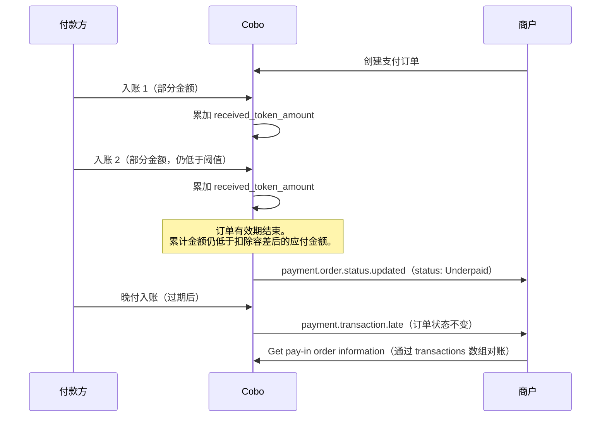
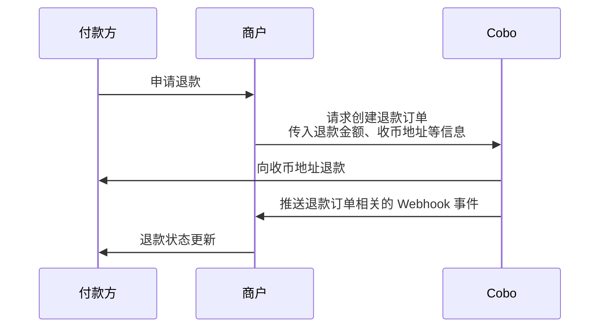

订单模式适用于需要指定具体支付金额和时限的场景。在该模式下，Cobo 会创建带有以下特点的支付订单：

- **固定金额**：订单创建时即指定具体的应付金额
- **有效期限**：付款方需要在指定时间内完成支付
- **异常处理**：支持多种异常情况的处理，包括：
  - 取消尚未支付的订单
  - 对已支付订单发起退款
  - 处理多付、少付、晚付等支付异常

如需对比订单模式与充值模式，选择符合业务需求的模式，请参考[订单模式与充值模式对比](/payments/cn/guides/overview#订单模式与充值模式对比)。

## 创建订单

您可以通过两种方式创建订单：

- 调用 [Create pay-in order](/payments/en/api-references/payment/create-pay-in-order) 直接创建一个支付订单。Cobo 会同步创建该订单，并在接口响应中返回 `order_id`，以及应付金额、付款地址等信息。您需要自行搭建前端页面，也可借助 [React SDK / Vue SDK](/payments/cn/guides/payment-toolkit) 引入 Web3 支付能力；
- 调用 [Create order link](/payments/en/api-references/payment/create-order-link) 创建一个订单支付链接。此调用仅返回支付链接——Cobo 此时尚未创建支付订单，因此还没有 `order_id`。该链接会跳转到由 Cobo 提供的支付页面，付款方在该页面选择支付代币和区块链网络并提交订单后，Cobo 才会创建该订单并生成 `order_id`。您还可以通过 iFrame 方式将该支付页面嵌入到您的网站或应用中。

该订单的收款商户为订单创建时指定的商户，且该归属之后不会改变。有关订单与充值两种收款方式的完整资金路由模型，请参考[账户与资金分配](/payments/cn/guides/amounts-and-balances#充币归属)。

### 前提条件

在创建收款订单之前，请确认满足以下条件。

| 前提条件 | 是否必需 |
| --- | --- |
| 已完成 [Payments 入驻](/payments/cn/guides/preparation)，即您团队的支付开发者账户处于活跃状态 | 必需 |
| `merchant_id` 指向一个已存在且归属于您团队的商户 | 必需 |
| 该商户已完成 KYB | 非必需 |
| 该商户已激活并处于活跃状态 | 非必需 |
| 该商户已完成额外配置 | 非必需 |
| 该商户存在开发者费率配置记录 | 非必需 |

完成 [Payments 入驻](/payments/cn/guides/preparation)后，系统会自动为您的团队创建一个可直接使用的默认商户，您可以直接将其用作 `merchant_id` 的取值。如果您需要额外的商户，请参考 [Create merchant](/payments/en/api-references/payment/create-merchant)。

<Note>
  Create pay-in order 不会单独校验商户 KYB、商户激活或活跃状态、商户配置，或该商户是否存在开发者费率配置记录。这些检查不能替代完成团队级别的 Payments 入驻——如果您团队的支付开发者账户未处于活跃状态，无论商户状态如何，请求都会失败。详情请参考[错误码与状态码](/payments/cn/guides/error-codes)。
</Note>

### 操作步骤

<Tabs>
  <Tab title="使用 Payments API 创建支付订单" icon="code">
    您可以调用 [Create pay-in order](/payments/en/api-references/payment/create-pay-in-order) 来创建一个支付订单。下图展示了付款方、商户与 Cobo 之间的完整交互流程：

    <div style={{ maxWidth:"600px",margin:"0 auto" }}>
    ```mermaid
    sequenceDiagram
        participant 付款方
        participant 商户
        participant Cobo
        付款方 ->> 商户: 确定用于支付的币种和链
        商户 ->> Cobo: ① （可选）查询汇率
        Cobo ->> 商户: （可选）返回汇率
        商户 ->> 付款方: 返回预估的应付金额
        付款方 ->> 商户: 确认支付订单
        商户 ->> Cobo: ② 请求创建支付订单
        Cobo ->> Cobo: 创建订单，生成 order_id
        Cobo ->> 商户: 返回 order_id、收币地址和应付金额
        Cobo ->> Cobo: 地址入账轮询
        付款方 ->> Cobo: 向地址付款
        Cobo ->> Cobo: 合规检查
        Cobo ->> 商户: ③ 推送订单相关的 Webhook 事件
        商户 ->> 付款方: 更新商品订单状态
    ```

    </div>

    在步骤 ② 中，Cobo 会创建该支付订单并生成 `order_id`，并在 [Create pay-in order](/payments/en/api-references/payment/create-pay-in-order) 的响应中同步返回。

    创建订单时，您需要在以下两种方式中**选择一种适合业务的金额参数组合**：

    - \*\*方式一：\*\*原订单商品以法币定价，您需要收取数字货币金额
      - 填写：`pricing_currency`、`pricing_amount`、`payable_currency`；
      - 不填：`payable_amount`
    - \*\*方式二：\*\*原订单商品以数币定价，您直接按原币种收取数字货币金额
      - 填写：`payable_currency`、`payable_amount`；
      - 不填：`pricing_currency`、`pricing_amount`

    同时填写两种方式的参数，或不符合以上任一组合的请求，将被拒绝。

    您可以先了解以下订单金额相关的字段定义：

    - **定价币种**（`pricing_currency`）：商品法币计价单位，目前支持设置法币币种请参考 [支持的币种与公链](/payments/cn/guides/supported-chains-and-tokens)。该字段为可选字段，如果您商品定价为数字货币则无需填写。
    - **定价金额**（`pricing_amount`）：商品法币计价金额，以 `pricing_currency` 指定的法币为单位。该字段为可选字段，如果您商品定价为数字货币则无需填写。
    - **应付币种**（`payable_currency`）： 付款方需要支付的数字货币币种，目前支持数字货币币种请参考 [支持的币种与公链](/payments/cn/guides/supported-chains-and-tokens)
    - **应付金额**（`payable_amount`）：付款方需要支付的数字货币金额，以`payable_currency` 指定的加密货币为单位。该字段为可选字段：
      - 如果您指定了 `payable_amount`，则系统直接使用该值作为付款方需支付的金额。
      - 如果您未指定 `payable_amount`，系统将使用实时汇率计算：**应付金额 =（订单金额 + 开发者费用）/ 汇率**。汇率以创建订单时调用 [Get exchange rate](/payments/en/api-references/payment/get-exchange-rate) 操作返回的汇率为准。
    - **开发者费用**（`fee_amount`）：如果您是服务多个下游商户的平台机构，需要在您和下游商户之间分配收入，可以通过设置该费用来实现。此费用以`payable_currency` 指定的加密货币为单位。实际分成的开发者费用=开发者费用/应付金额\*实际收款金额，更多信息请参考[账户与资金分配](/payments/cn/guides/amounts-and-balances)。

    <Info>
      如果您是商户（直接服务于付款方），通常无需设置开发者费用。
    </Info>
    下表展示了在不同设置下，系统如何计算应付金额：

    |                    | 场景 1                                         | 场景 2                                        |
    | :----------------- | :------------------------------------------- | :------------------------------------------ |
    | 场景描述               | - 订单金额以法币计价<br />- 无需设置开发者费用<br />- 系统计算应付金额 | - 订单金额以加密货币计价<br />- 设置开发者费用<br />- 自定义应付金额 |
    | `pricing_currency` | `"USD"`                                      | 不设置                                         |
    | `pricing_amount`   | `"100"`                                      | 不设置                                         |
    | `payable_currency` | `"ETH_USDT"`                                 | `"ETH_USDT"`                                |
    | `payable_amount`   | 不设置                                          | `"104.08"`                                  |
    | `fee_amount`       | `"0"` 或不设置                                   | `"2"`                                       |
    | 实时汇率               | 0.99                                         | 不适用（使用自定义应付金额）                              |
    | 应付计算过程             | (100 + 0) / 0.99                             | 直接使用指定的 payable_amount                      |
    | 最终应付金额             | `"101.01"`                                   | `"104.08"`                                  |
    | 开发者费用计算过程          | 0                                            | 2/104.08\*104.08                            |
    | 最终开发者费用            | `"0"`                                        | `"2"`                                       |
  </Tab>
  <Tab title="使用 Payments API 创建支付链接" icon="browser">
    您可以调用 [Create order link](/payments/en/api-references/payment/create-order-link) 创建一个订单支付链接。此调用仅返回支付链接——Cobo 此时尚未创建支付订单，因此还没有 `order_id`。完整流程如下：

    1. Cobo 生成并返回支付链接。此时尚不存在订单，也没有 `order_id`。
    2. 付款方打开由 Cobo 提供的托管支付页面。
    3. 付款方选择支付代币和区块链网络并提交订单。
    4. Cobo 创建该支付订单并生成 `order_id`。
    5. Cobo 向商户发送 [`payment.order.status.updated`](/payments/cn/guides/status-and-events#paymentorderstatusupdated) Webhook 事件，状态为 `Pending`，并携带新生成的 `order_id`。

    具体的支付页面效果和集成步骤请参考[创建订单支付链接](/payments/cn/guides/payment-link)。
  </Tab>
</Tabs>

## 查询订单状态

您可以订阅以下 Webhook 事件，以获取订单状态的实时更新通知。请参考 [Webhook reference](/payments/cn/guides/status-and-events) 了解每个事件的触发时间和返回的数据结构。

- `payment.order.status.updated`
- `payment.transaction.late`
- `payment.transaction.completed`

您也可以通过 Payments App 或 Payments API 主动查询订单状态。

<Tabs>
  <Tab title="Payments App" icon="pager">
    1. 登录 Cobo Portal [开发环境](https://portal.dev.cobo.com/login)或[生产环境](https://portal.cobo.com/login)。
    2. 在左侧导航栏中点击 **Apps**，然后点击 **Payments** 卡片，启动 App。
    3. 在 App 的左侧导航栏中点击**收款** \> **订单**。您可以在此页面查看所有订单的详细信息，如订单 ID、商户信息、支付金额、订单状态等。
    4. 当付款方完成支付、且交易通过合规筛查后，订单状态会流转为**已完成**。

    
  </Tab>
  <Tab title="Payments API" icon="code">
    您可以调用 [Get pay-in order information](/payments/en/api-references/payment/get-pay-in-order-information) 查询单个支付订单状态，或调用 [List all pay-in orders](/payments/en/api-references/payment/list-all-pay-in-orders) 查询所有订单状态。
  </Tab>
</Tabs>

## 异常情况

在订单模式下，您可能要处理以下几种异常情况。

### 撤销支付订单

当一笔支付订单在 `Pending` 状态下，即尚未检测到入账交易时，您可以调用 [Update pay-in order](/payments/en/api-references/payment/update-pay-in-order) 撤销该订单。撤销后，订单状态将变更为 `Expired`。

### 少付、多付、部分付款和晚付

在支付过程中可能出现以下四种异常情况：

| 异常情况 | 描述 | 影响 |
| --- | --- | --- |
| [**少付**](#少付) | 订单有效期结束时，累计实收金额仍低于扣除容差后的应付金额 | 订单状态变为 `Underpaid`（终态）。 |
| [**多付**](#多付) | 在订单有效期内，付款方实付金额超过应付金额 | 订单最终状态为 `Completed`。 |
| [**部分付款**](#部分付款) | 在订单有效期内，付款方通过多笔成功转账完成订单付款 | 没有单独的订单状态。订单将保持当前状态，直到累计实收金额使订单达到 `Completed`，或订单过期并变为 `Underpaid`。 |
| [**晚付**](#晚付) | 订单达到 `Expired`、`Underpaid` 或 `Completed` 后收到付款 | 不会改变订单终态。每次晚付都会触发一次 `payment.transaction.late` Webhook 事件。 |

#### 少付

如果订单有效期结束时，所有通过合规筛查的成功入账累计金额仍低于应付金额减去允许的 `amount_tolerance`，则订单会被视为少付。在订单过期前，Cobo 会继续累加成功入账，并将累计金额与该阈值进行比较。如果订单过期时累计金额仍低于阈值，订单将流转为终态 `Underpaid`。

您可以通过 `received_token_amount` 跟踪累计实收金额，并通过 `transactions` 数组查看每笔入账。以上字段均由 [Get pay-in order information](/payments/en/api-references/payment/get-pay-in-order-information) 返回。

有关少付资金的结算方式，请参考[账户与资金分配](/payments/cn/guides/amounts-and-balances)。订单变为 `Underpaid` 后收到的额外充币将按[晚付](#晚付)处理。

#### 多付

当付款方实付金额超过应付金额时，订单在达到应付金额阈值后仍会流转为 `Completed`。系统没有公开的 `Overpaid` 订单状态。

超出部分会计入 `received_token_amount`，导致多付的入账也会显示在 `transactions` 数组中。以上字段均由 [Get pay-in order information](/payments/en/api-references/payment/get-pay-in-order-information) 返回。

有关超出金额在商户账户和开发者账户之间的结算方式，请参考[账户与资金分配](/payments/cn/guides/amounts-and-balances)。如需将超出金额退还给付款方，请按照[处理退款申请](#处理退款申请)中的说明发起退款。

#### 部分付款

付款方可以通过多笔转账完成一个订单。每笔成功转账都会累计到订单的 `received_token_amount` 中，每笔入账也会显示在 `transactions` 数组中。以上字段均由 [Get pay-in order information](/payments/en/api-references/payment/get-pay-in-order-information) 返回。

收到部分付款的订单没有单独的状态。订单将保持当前状态，直到出现以下任一情况：

- 累计实收金额在允许的容差范围内达到应付金额，订单变为 `Completed`；或
- 订单有效期结束时，累计实收金额仍低于该阈值，订单变为 `Underpaid`。请参考[少付](#少付)。

完成条件基于累计金额而非单笔转账进行评估。因此，付款方可以在订单过期前发送额外转账，使累计金额达到完成阈值。

#### 晚付

如果一笔通过合规筛查的充币交易在订单达到 `Expired`、`Underpaid` 或 `Completed` 后才入账，则该笔交易属于晚付。晚付不会改变订单的终态。

每笔晚付入账都会触发一次 `payment.transaction.late` Webhook 事件。该笔入账也会记录在订单的 `transactions` 数组中，您可以通过 [Get pay-in order information](/payments/en/api-references/payment/get-pay-in-order-information) 获取该数组，并根据订单历史进行对账。

有关晚付资金的入账方式，请参考[充币归属](/payments/cn/guides/amounts-and-balances#充币归属)。

以下时序展示了单个订单中[少付](#少付)、[多付](#多付)、[部分付款](#部分付款)和[晚付](#晚付)之间的关系：

<div style={{ maxWidth:"600px",margin:"0 auto" }}>


</div>

[账户与资金分配](/payments/cn/guides/amounts-and-balances)中详细介绍了多付、少付和晚付情况下 Cobo 对资金的处理规则。

在资金转出前，Cobo 还会自动将通过订单收到的资金从收款地址归集。详情请参考[自动资金归集](/payments/cn/guides/crypto-payouts#2-自动资金归集)。

### 处理退款申请

您可以通过 Payments App 或 Payments API 发起一笔退款订单，将资金退还给付款方。下图展示了退款环节中，付款方、商户以及 Cobo 之间的交互流程。

<div style={{ maxWidth:"600px",margin:"0 auto" }}>


</div>

#### 创建退款订单

<Tabs>
  <Tab title="Payments App" icon="pager">
    1. 登录 Cobo Portal [开发环境](https://portal.dev.cobo.com/login)或[生产环境](https://portal.cobo.com/login)。
    2. 在左侧导航栏中点击 **Apps**，然后点击 **Payments** 卡片，启动 App。
    3. 在 App 的左侧导航栏中点击**收款** \> **订单**。
    4. 选择目标订单，然后点击右侧的**查看详情**按钮。

    

    5. 在订单详情页面，点击**退款**按钮。

    

    6. 在弹出的表单中：
       - 选择退款金额的来源，可以选择**商户余额**或**开发者余额**。
       - 填入退款金额。该金额不得高于对应的商户余额或开发者余额。
       - （可选）填入开发者费用金额。该手续费会从退款金额中扣除，归入开发者余额。有关开发者费用的详细说明，请参考[账户与资金分配](/payments/cn/guides/amounts-and-balances)。
       - 输入收款地址。您可以点击**使用原始支付地址**，系统将自动填入该笔订单的原始支付地址。如果您想退款到其他地址，也可以手动输入目标地址。
    5. 点击**预览**确认所有信息无误后，点击**提交**创建退款订单。
  </Tab>
  <Tab title="Payments API" icon="code">
    调用 [Create refund order](/payments/en/api-references/payment/create-refund-order) 创建退款订单。创建退款订单时需要注意以下几点：

    - 您需要通过 `refund_type` 字段指定退款金额的来源。当您选择 `Merchant` 时，Cobo 会从商户余额中扣除退款金额；当您选择 `Psp` 时，Cobo 会从开发者余额中扣除退款金额。
    - 由于退款涉及到向外部地址转账，Cobo 会收取相关手续费。您可以通过开发者费用字段（`merchant_fee_amount`）收取适当的费用作为补偿。指定该字段后：
      - 如果您选择从商户余额中扣除退款金额，Cobo 会将开发者费用从商户余额划转至开发者余额，资金会保留在原地址，不会发生实际转账。
      - 付款方实际收到的退款金额 = 指定退款金额 - 开发者费用（即 `payable_amount` - `merchant_fee_amount`）。
      - Cobo 会对退款金额进行校验。如果退款金额小于开发者费用，该请求将被拒绝并返回失败原因，因为此时付款方实际无法收到任何退款。

    <Info>
      关于更多开发者费用的说明，请参考[账户与资金分配](/payments/cn/guides/amounts-and-balances)。
    </Info>
  </Tab>
</Tabs>

#### 查询退款订单状态

您可以订阅 `payment.refund.status.updated` 事件，获取退款订单状态的实时更新。请参考 [Webhook reference](/payments/cn/guides/status-and-events) 了解每个事件的详细触发条件和返回的数据结构。

您也可以通过 Payments App 或 Payments API 主动查询退款订单状态。

<Tabs>
  <Tab title="Payments App" icon="pager">
    1. 登录 Cobo Portal [开发环境](https://portal.dev.cobo.com/login)或[生产环境](https://portal.cobo.com/login)。
    2. 在左侧导航栏中点击 **Apps**，然后点击 **Payments** 卡片，启动 App。
    3. 在 App 的左侧导航栏中点击**收款** \> **订单**。
    4. 点击**退款**标签页。在退款订单列表中，找到目标订单，然后点击右侧的**查看详情**按钮。

    

    5. 在退款订单详情页面查看订单状态。
  </Tab>
  <Tab title="Payments API" icon="code">
    您可以调用 [Get refund order information](/payments/en/api-references/payment/get-refund-order-information) 查询单个退款订单状态，或调用 [List all refund orders](/payments/en/api-references/payment/list-all-refund-orders) 查询所有退款订单状态。
  </Tab>
</Tabs>

### 合规筛查不通过

当某笔交易收到 `payment.transaction.failed` 事件时，这表明该笔交易未能通过 Cobo KYT 或 Screening App 的合规筛查。这种情况下，您需要按照以下步骤进行处理：

- 若该笔交易后续通过人工审核：
  - 如果订单未过期：该笔资金将计入订单实收金额，订单状态将根据实收金额相应更新
  - 如果订单已过期：系统将触发 `payment.transaction.late` 事件，该笔资金将全部计入开发者余额
- 若该笔交易最终未通过人工审核：
  - 资金将被冻结，不会被计入订单实收金额
  - 订单状态将保持不变
  - 付款方需要在订单有效期内重新充入足额资金并通过合规筛查，订单才能转为 `Completed` 状态

对于被隔离或冻结的资金：

- Cobo KYT：请通过 [help@cobo.com](mailto:help@cobo.com) 联系 Cobo 支持团队处理
- Screening App：您可以在应用内自行评估和处理

### 最小入账金额限制

为优化您的账户成本，避免因粉尘金额产生的入账手续费高于交易金额，系统设定了最小入账阈值。当单笔交易金额低于 **0.05 USDT**（或等值币种）时，系统将不自动进行入账处理。\
_注：若您需要对此类低于阈值的累积资金进行手动处理，请联系 Cobo 客服或技术支持，我们将协助您从归集地址提取。_
