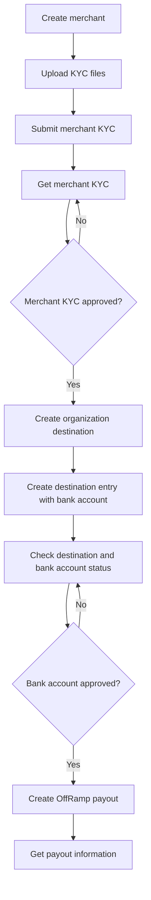

企业三方下发用于由付款企业向另一个企业的已审核银行账户发起 OffRamp Payout。该流程不是一次 API 调用，而是先完成付款企业的 Merchant KYC，再为收款企业创建并审核 Destination 和银行账户，最后发起 OffRamp Payout。

本指南作为完整调用链路清单。完整请求和响应 Schema 请以链接的 API 参考页面为准。

## 概述

企业三方下发涉及两个独立审核：

- Merchant KYC 审核付款企业。
- Destination Entry 审核收款企业及其银行账户。

只有两个审核均通过后，才发起实际 Payout。

## 前提条件

开始接入前，请完成以下准备：

- 创建 API 凭证，并按照[认证规范](/payments/cn/developer-tools/cobo-auth)为生产请求生成签名。
- 先在开发环境 `https://api.dev.cobo.com/v2` 完成联调。
- 仅在测试完成且生产权限已开通后，使用生产环境 `https://api.cobo.com/v2`。
- 确认您的账号已开通企业三方下发能力，且 Merchant KYC 和 OffRamp provider 配置已生效。

## 完整调用链路



## 创建 Merchant

调用 [Create merchant](/payments/en/api-references/payment/create-merchant) 创建付款企业对应的 Merchant。

```bash
curl --request POST \
  --url https://api.dev.cobo.com/v2/payments/merchants \
  --header 'Content-Type: application/json' \
  --header 'BIZ-API-KEY: <your-api-key>' \
  --data '{
    "name": "Merchant A"
  }'
```

保存响应中的 `merchant_id`。后续 Merchant KYC、Destination 归属关系和 Payout 的 `source_account` 都会使用该值。

## 上传 Merchant KYC 文件

调用 [Upload file](/payments/en/api-references/payment/upload-file) 上传企业 KYB 文件。保存每个文件返回的 `file_id`，并在 [Submit merchant KYC](/payments/en/api-references/payment/submit-merchant-kyc) 中引用。

常见企业材料包括：

- 公司注册证明或营业执照。
- 商业登记或公司地址证明。
- 董事、UBO、法人或授权人的身份证明。
- 相关自然人的地址证明。
- 业务证明、平台材料，或所选 `kyc_type` 要求的其他附件。

`file_type`、文件格式、大小限制和必填附件组合以 Upload file 和 Submit merchant KYC 的在线 Schema 为准。不要在 KYC 请求中直接传入本地文件路径。

## 提交并查询 Merchant KYC

调用 [Submit merchant KYC](/payments/en/api-references/payment/submit-merchant-kyc)，为 `merchant_id` 提交企业主体资料。企业三方下发应提交在线 Schema 要求的企业 KYC 信息。

| 字段组 | 用途 | 规则 |
| --- | --- | --- |
| `merchant_id` | 标识被审核的 Cobo Merchant。 | 使用 Create merchant 返回值。 |
| `merchant_type` | 标识注册业务类型。 | 按在线 Schema 支持的取值传入。 |
| `kyc_type` | 标识企业主体类型。 | 使用在线 Schema 支持的企业取值。 |
| `company_info` | 提供公司主体、注册、地址、行业等资料。 | 按企业主体要求填写必填字段。 |
| `legal_info` | 提供董事、UBO、法人或授权人资料。 | 按主体类型和角色要求填写。 |
| `attachments` | 引用已上传的证明文件。 | 使用 Upload file 返回的 `file_id`。 |

严格按照 Submit merchant KYC 在线 Schema 中的条件必填规则组装请求。不要将企业 Schema 与个人 Schema 混传。

调用 [Get merchant KYC](/payments/en/api-references/payment/get-merchant-kyc) 查询审核结果，直到审核结果允许发起 Payout。Create merchant 成功只代表 Merchant 已创建，不代表 Merchant KYC 已通过。

## 创建企业 Destination

调用 [Create destination](/payments/en/api-references/payment/create-destination) 将收款企业创建为 Organization 类型的 Destination。

```bash
curl --request POST \
  --url https://api.dev.cobo.com/v2/payments/destination \
  --header 'Content-Type: application/json' \
  --header 'BIZ-API-KEY: <your-api-key>' \
  --data '{
    "destination_name": "ABC Trading Limited",
    "destination_type": "Organization",
    "merchant_id": "M1001",
    "country": "USA",
    "email": "finance@example.com",
    "contact_address": "123 Main Street, New York, USA"
  }'
```

企业收款人使用 `destination_type` = `Organization`。`country` 使用 ISO 3166-1 alpha-3 国家或地区代码，例如 `USA`、`HKG`。保存响应中的 `destination_id`。

## 添加企业银行账户

调用 [Create destination entry](/payments/en/api-references/payment/create-destination-entry) 为 Destination 添加收款企业银行账户。

```bash
curl --request POST \
  --url https://api.dev.cobo.com/v2/payments/destination_entry \
  --header 'Content-Type: application/json' \
  --header 'BIZ-API-KEY: <your-api-key>' \
  --data '{
    "destination_id": "<destination_id>",
    "bank_accounts": [
      {
        "account_alias": "Main USD Account",
        "account_number": "123456789",
        "currency": "USD",
        "beneficiary_name": "ABC Trading Limited",
        "beneficiary_address": "123 Main Street, New York, USA",
        "bank_name": "Example Bank",
        "bank_address": "New York, USA",
        "swift_code": "BOFAUS33"
      }
    ]
  }'
```

`beneficiary_name` 应与收款企业法定名称一致。USD SWIFT 场景通常需要账户号、银行名称、SWIFT/BIC 和银行地址。IBAN、本地 routing、中间行、further credit 等字段是否需要，以在线 Schema 和具体银行路由要求为准。

保存返回的 `bank_account_id`，并关注 `bank_account_status`。

## 确认收款账户可用

发起 Payout 前，调用 [Get destination information](/payments/en/api-references/payment/get-destination-information)、[List destination entries](/payments/en/api-references/payment/list-destination-entries) 或 [Get destination entry information](/payments/en/api-references/payment/get-destination-entry-information)，并确认：

- Merchant KYC 已通过。
- `destination_type` 为 `Organization`。
- `bank_account_id` 存在，且状态允许发起 Payout。
- Payout 的法币 `currency` 与银行账户币种一致。
- Destination 归属于付款 `merchant_id`。

Destination 创建成功不代表银行账户可立即用于 Payout。

## 发起 OffRamp Payout

调用 [Create payout](/payments/en/api-references/payment/create-payout)，并设置 `payout_channel` = `OffRamp`。

```bash
curl --request POST \
  --url https://api.dev.cobo.com/v2/payments/payouts \
  --header 'Content-Type: application/json' \
  --header 'BIZ-API-KEY: <your-api-key>' \
  --data '{
    "request_id": "merchant-a-payout-20260729-0001",
    "source_account": "M1001",
    "payout_channel": "OffRamp",
    "payout_params": [
      {
        "token_id": "ETH_USDT",
        "amount": "500.00"
      }
    ],
    "recipient_info": {
      "currency": "USD",
      "bank_account_id": "<bank_account_id>",
      "transfer_via_va": false
    },
    "remark": "Supplier payment"
  }'
```

| 字段 | 含义 | 规则 |
| --- | --- | --- |
| `request_id` | 客户侧业务请求唯一标识，用于幂等控制。 | 同一笔业务重试时沿用原值；不同业务使用新值。 |
| `source_account` | Payout 扣款账户。 | 企业场景使用已通过审核的付款企业 `merchant_id`。 |
| `payout_channel` | 资金转出渠道。 | 法币出金设置为 `OffRamp`。 |
| `payout_params` | 扣减的加密资产。 | 传入 `token_id` 和 `amount`。 |
| `recipient_info.currency` | 收款银行账户接收的法币币种。 | 使用已审核银行账户支持的币种，例如 `USD`。 |
| `recipient_info.bank_account_id` | 收款企业银行账户。 | 使用已审核通过的企业 `bank_account_id`。 |
| `transfer_via_va` | 是否先进入虚拟账户再转入银行账户。 | 直接下发至银行账户时设置为 `false`。 |

`request_id` 是客户侧幂等键。同一笔业务重试时，不要生成新的 `request_id`。

## 查询 Payout 结果

使用 Create payout 返回的 `payout_id` 调用 [Get payout information](/payments/en/api-references/payment/get-payout-information)。

```http
GET /payments/payouts/{payout_id}
```

通用 Payout 执行逻辑、状态含义、Webhook 更新和列表查询请参考 [Off-Ramp 对接](/payments/cn/guides/fiat-payouts)和[状态与事件](/payments/cn/guides/status-and-events)。

## 常见失败与排查

| 问题 | 排查方法 |
| --- | --- |
| Merchant KYC 未通过。 | 调用 Get merchant KYC，不要只检查 Merchant 是否存在。 |
| 收款银行账户未通过。 | 查询 Destination 或 Destination Entry，并确认 `bank_account_status`。 |
| `source_account` 错误。 | 使用已完成 Merchant KYC 的 `merchant_id`。 |
| `bank_account_id` 不属于该业务主体。 | 检查 Destination 与 `merchant_id` 的关联关系。 |
| 银行字段不完整。 | 按国家或地区、币种、SWIFT、IBAN 或 local routing 规则补齐字段。 |
| `request_id` 重复或使用不当。 | 同一笔业务重试沿用原 `request_id`；不同业务使用新值。 |
| `transfer_via_va` 取值错误。 | 直接下发至银行账户时设置为 `false`。 |
| 余额或币种不满足要求。 | 确认 `source_account` 的可用余额、`token_id` 与目标法币支持关系。 |

## 相关指南

- [商户管理](/payments/cn/guides/merchants)
- [转出目的地](/payments/cn/guides/destinations)
- [Off-Ramp 对接](/payments/cn/guides/fiat-payouts)
- [集成指南](/payments/cn/guides/quick-start)
- [API Playground](/payments/en/api-references/playground)
