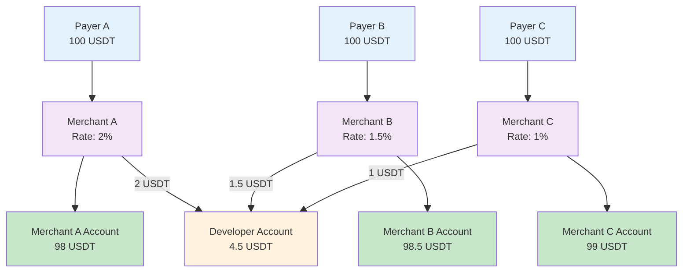
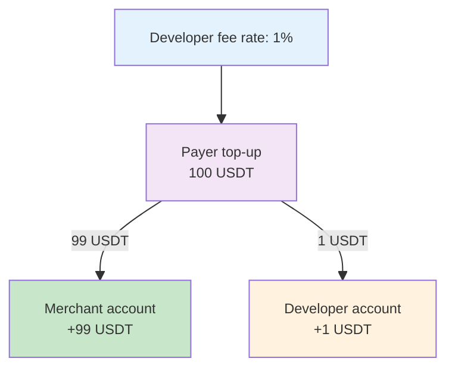
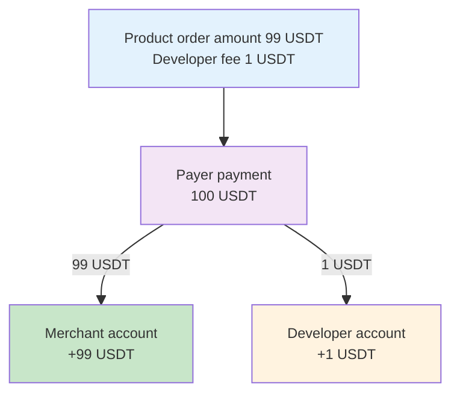
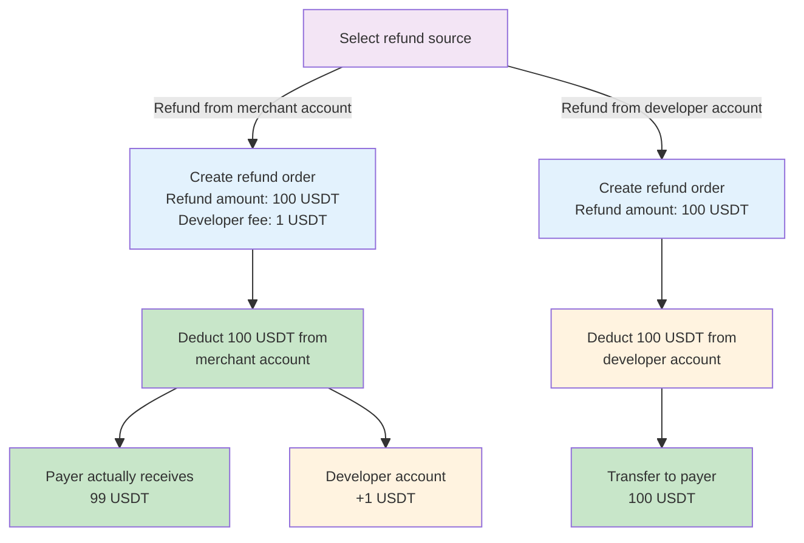
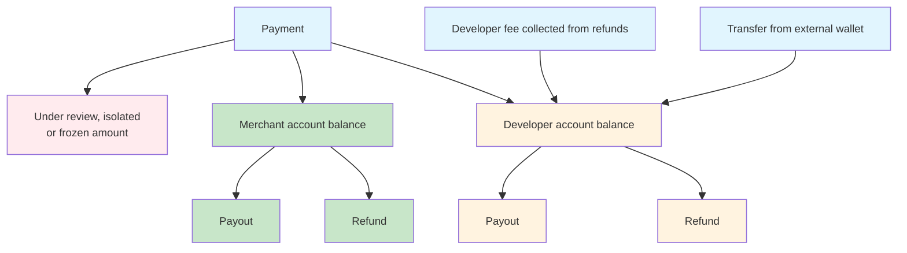

<Note>**Disclaimer: This article contains AI translations and should only be used as reference.** Contact Cobo's support team through [help@cobo.com](mailto:help@cobo.com) if you have any questions.</Note>

This topic explains how funds are organized into accounts, how funds are distributed between accounts through settlement and allocation, and how balances are calculated.

## Accounts

Cobo uses accounts to organize and track funds. There are two types of accounts:

- **Developer account**: A single account that holds your developer balance. This represents funds belonging to you as the entity providing payment collection services.
- **Merchant accounts**: One account per merchant that holds the respective merchant balance. Each merchant represents an actual business entity receiving payments.

When you perform operations such as payouts or refunds, you need to select which account to use as the source of funds.

By creating merchants and setting developer fees/rates, you can achieve automated fund settlement and revenue sharing:

- If you serve payers directly:
  - Usually, you only need to create one merchant (use the merchant created by default by the system), and there is no need to configure a developer fee rate.
  - If you want to manage funds separately for different business lines, you can create a merchant for each business line.
- If you are a platform institution serving multiple downstream merchants, you can create a merchant in the system for each downstream merchant and achieve automated merchant settlement and platform revenue allocation by setting developer fees/rates.

For more information on usage scenarios and descriptions of merchant management, refer to [Merchant management](/payments/en/guides/merchants).

## Settlement and allocation

Funds can be distributed between accounts in two ways:

- **Automatic settlement**: During the pay-in process, funds are automatically settled to the merchant account and developer account based on predefined rules.
- **Manual allocation**: You can manually allocate funds between accounts using the Allocate feature in the Payments App.

### Automatic settlement

When a payment is received, funds are automatically settled to the merchant account and developer account. The settlement rules differ depending on the pay-in type.

The following diagram shows the overall automatic settlement and flow of funds during the payment process (sample data):

#### Top-up mode

In top-up mode, fund settlement is based on the developer fee rate (`developer_fee_rate`) set when creating the merchant. The developer fee rate determines the proportion settled to the developer account in each top-up.

**Example**: When the developer fee rate is 1%, a 100 USDT top-up will be settled as 99 USDT to the merchant account and 1 USDT to the developer account.

#### Order mode

In order mode, fund settlement is based on the amount parameters set when creating the order. The ratio between the developer fee (`fee_amount`) and the product order amount (`order_amount`) determines the proportion settled to the developer account in each order.

**Example**: When the product order amount is 99 USDT and the developer fee is 1 USDT, the actual received amount of 100 USDT from the order will be settled as 99 USDT to the merchant account and 1 USDT to the developer account:

<Note>
Special case handling:

- Overpayment/Underpayment: Settle funds according to the same ratio as above
- Late payment: All funds are settled to the developer account
</Note>

#### Refunds

The source of the refund amount can be either the merchant account or the developer account.

- When the refund amount comes from the merchant account, you can specify the developer fee amount. For example, when the refund amount (`payable_amount`) is 100 USDT and the developer fee (`merchant_fee_amount`) is 1 USDT, 1 USDT from the 100 USDT refund amount will be allocated to the developer account, and the payer will actually receive 99 USDT.
- When the refund amount comes from the developer account, the developer fee field will be ignored, and the full refund amount will be deducted from the developer account and transferred to the payer.

The following diagram shows the allocation and flow of funds during the refund process (sample data):

### Manual allocation

In addition to automatic settlement during pay-in, you can manually allocate funds between accounts using the Allocate feature in the Payments App. For more information, see [Allocate funds](/payments/en/guides/allocate-funds).

## Balances

Each account has a balance that represents the available funds. The following diagram shows the main sources and uses of merchant account balances and developer account balances:

<Info>Under review/isolated/frozen amounts will not be counted towards account balances.</Info>

### Merchant account balance

**Merchant account balance** refers to the total amount of funds in a merchant account that can be used for payouts or refunds at a specific moment.

- Increases balance: Settlement, allocation in
- Decreases balance: Payout, refund, allocation out

This balance can be queried through the **Balance** module of Payments App or by calling [List merchant balances](/payments/en/api-references/payment/list-merchant-balances).

### Developer account balance

**Developer account balance** refers to the total amount of funds in the developer account that can be used for payouts or refunds at a specific moment.

- Increases balance: Settlement, allocation in, developer fee collected from refunds
- Decreases balance: Payout, refund, allocation out

This balance can be queried through the **Balance** module of Payments App or by calling [Get developer balance](/payments/en/api-references/payment/get-developer-balance).

<Tip>Feel free to [share your feedback](https://forms.zohopublic.com/cobo/form/DocumentFeedbackForm/formperma/QvLOhxJv1_JMsJ-1dleZ8Itb_7rzN-LtgvsDdxosoVI) to improve our documentation!</Tip>
