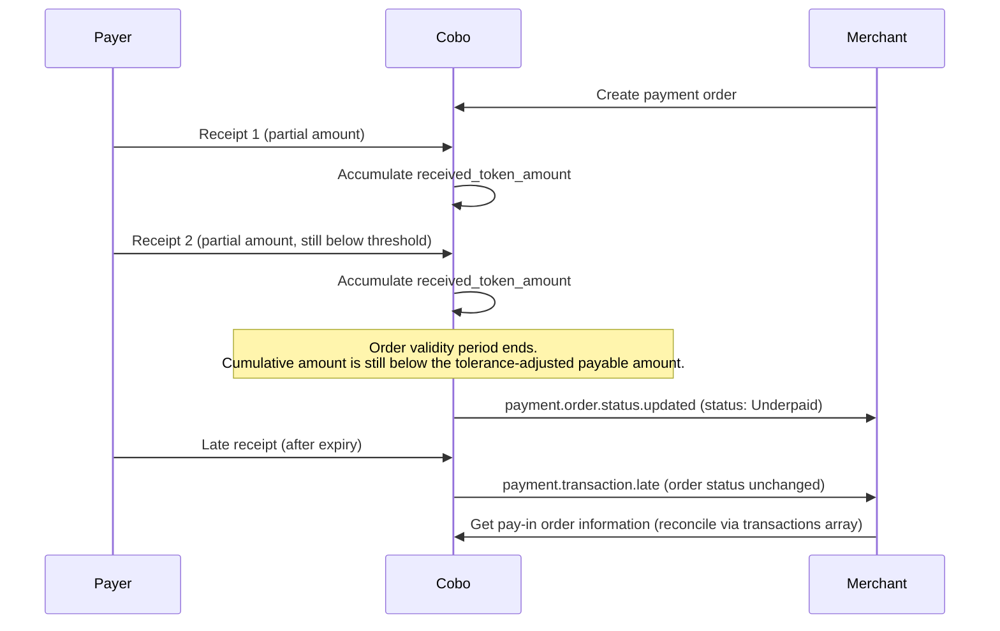
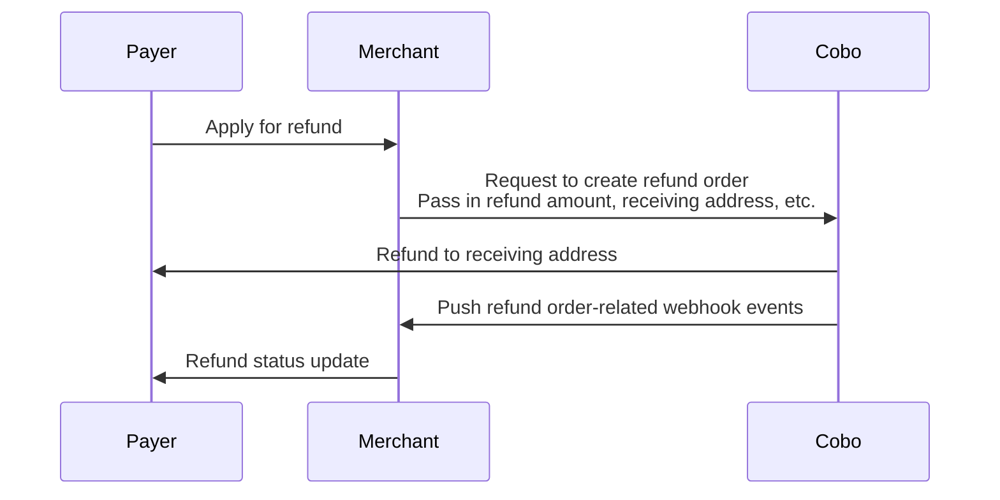

<Note>
  **Disclaimer: This article contains AI translations and should only be used as reference.**
</Note>

Order mode is suitable for scenarios that require specifying a specific payment amount and time limit. In this mode, Cobo creates payment orders with the following characteristics:

- **Fixed amount**: The amount payable is specified when the order is created
- **Validity period**: Payers need to complete payment within the specified time
- **Exception handling**: Supports handling various exception situations, including:
  - Canceling orders that have not been paid
  - Initiating refunds for paid orders
  - Handling payment exceptions such as overpayment, underpayment, and late payment

To compare Order mode with Top-up mode and choose the mode that fits your business, refer to [Order mode vs. Top-up mode](/payments/en/guides/overview#order-mode-vs-top-up-mode).

<div style={{ maxWidth:"600px",margin:"0 auto" }} />

## Create order

You can create an order in two ways:

- Call [Create pay-in order](/payments/en/api-references/payment/create-pay-in-order) to directly create a payment order. Cobo creates the order synchronously and returns its `order_id`, together with the payable amount and payment address, in the API response. You will need to build the frontend page yourself, or you can integrate Web3 payment capabilities using the [React SDK / Vue SDK](/payments/en/guides/payment-toolkit).
- Call [Create order link](/payments/en/api-references/payment/create-order-link) to generate a payment link. This call returns only the link — no payment order exists yet, so there is no `order_id`. The link directs the payer to a payment page provided by Cobo; once the payer selects the payment token and blockchain network and submits the order there, Cobo creates the order and generates the `order_id`. You can also embed this payment page into your website or application using an iFrame.

The merchant that receives payment for this order is the merchant specified when the order is created, and this destination does not change afterward. For the complete deposit-routing model across order and top-up payments, see [Accounts and fund allocation](/payments/en/guides/amounts-and-balances#deposit-attribution).

### Prerequisites

Before you can create a pay-in order, make sure the following requirements are met.

| Requirement | Status |
| --- | --- |
| [Payments onboarding](/payments/en/guides/preparation) is complete, so your organization's payment developer account is active | Required |
| `merchant_id` references a merchant that already exists and is owned by your organization | Required |
| The merchant has completed KYB | Not required |
| The merchant is activated and in an active status | Not required |
| The merchant has completed additional configuration | Not required |
| A developer-fee configuration record exists for the merchant | Not required |

Completing [Payments onboarding](/payments/en/guides/preparation) automatically provisions a default merchant for your organization, which you can use directly as the `merchant_id` value. If you need additional merchants, refer to [Create merchant](/payments/en/api-references/payment/create-merchant).

<Note>
  Create pay-in order does not independently check merchant KYB, merchant activation or status, merchant configuration, or whether a developer-fee configuration record exists for the merchant. These checks are not substitutes for completing organization-level Payments onboarding — if your organization's payment developer account is not active, the request fails regardless of merchant state. See [Error codes and status codes](/payments/en/guides/error-codes#general-api-errors) for details on this failure.
</Note>

### Implementation steps

<Tabs>
  <Tab title="Create order" icon="code">
    The following diagram shows the complete interaction process between payers, merchants, and Cobo during the order payment process:

    <div style={{ maxWidth:"600px",margin:"0 auto" }}>
    ```mermaid
    sequenceDiagram
        participant Payer
        participant Merchant
        participant Cobo
        Payer ->> Merchant: Determine token and chain for payment
        Merchant ->> Cobo: ① Query exchange rate
        Cobo ->> Merchant: Return exchange rate
        Merchant ->> Payer: Return estimated amount payable
        Payer ->> Merchant: Confirm payment order
        Merchant ->> Cobo: ② Request to create payment order
        Cobo ->> Cobo: Create order, generate order_id
        Cobo ->> Merchant: Return order_id, receiving address, and amount payable
        Cobo ->> Cobo: Address deposit polling
        Payer ->> Cobo: Make payment to address
        Cobo ->> Cobo: Compliance check
        Cobo ->> Merchant: ③ Push order-related webhook events
        Merchant ->> Payer: Update product order status
    ```

    </div>

    In step ②, Cobo creates the payment order and generates its `order_id`, returning both synchronously in the [Create pay-in order](/payments/en/api-references/payment/create-pay-in-order) response.

    #### Order identification fields

    Before you configure the amount fields, set the order identification fields so that you and Cobo can uniquely track the order:

    - **PSP order code (`psp_order_code`)**: Set this field to your own internal business order identifier. This field is required, and the value must be unique within your Cobo organization.
    - **Merchant order code (`merchant_order_code`)**: Set this field only if you are a platform or payment service provider (PSP) serving a downstream merchant that has its own separate order reference to track. This field is optional.

    If you serve payers directly as a merchant, you typically only need to set `psp_order_code` and can omit `merchant_order_code`. If you serve downstream merchants as a platform or PSP, set `psp_order_code` to your own order identifier, and additionally set `merchant_order_code` to the corresponding downstream merchant's order reference so that both you and the merchant can reconcile the order using your own identifiers.

    For example:

    - Platform or PSP serving a downstream merchant:

    ```json
    {
      "merchant_id": "M1001",
      "psp_order_code": "PSP-20260729-0042",
      "merchant_order_code": "SHOP88-INV-556213",
      "pricing_currency": "USD",
      "pricing_amount": "100",
      "payable_currency": "ETH_USDT"
    }
    ```

    - Direct merchant serving payers:

    ```json
    {
      "merchant_id": "M1001",
      "psp_order_code": "PSP-20260729-0042",
      "pricing_currency": "USD",
      "pricing_amount": "100",
      "payable_currency": "ETH_USDT"
    }
    ```

    For the complete list of request parameters, refer to [Create pay-in order](/payments/en/api-references/payment/create-pay-in-order).

    When creating an order, you must choose **one** of the following two amount parameter combinations based on your business model:

    - \*\*Option 1: \*\*The original order is priced in fiat currency, and you collect payment in cryptocurrency
      - **Required**: `pricing_currency`, `pricing_amount`, `payable_currency`
      - **Not required**: `payable_amount`
    - \*\*Option 2: \*\*The original order is priced in cryptocurrency, and you collect the payment directly in the same cryptocurrency
      - **Required**: `payable_currency`, `payable_amount`
      - **Not required**: `pricing_currency`, `pricing_amount`

    Requests that include parameters from both options, or that do not conform to either combination, will be rejected.

    You may refer to the following definitions of order amount–related fields:

    - **Pricing Currency (**`pricing_currency`**)**:\
      The fiat currency used to price the goods. For supported fiat currencies, please refer to [Supported Currencies and Blockchains](/payments/en/guides/supported-chains-and-tokens).\
      This field is optional and is not required if your goods are priced in cryptocurrency.
    - **Pricing Amount (**`pricing_amount`**)**:\
      The fiat price of the goods, denominated in the currency specified by `pricing_currency`.\
      This field is optional and is not required if your goods are priced in cryptocurrency.
    - **Payable Currency (**`payable_currency`**)**:\
      The cryptocurrency the payer needs to pay. For supported cryptocurrencies, please refer to [Supported Currencies and Blockchains](/payments/en/guides/supported-chains-and-tokens).
    - **Payable Amount (**`payable_amount`**)**:\
      The amount of cryptocurrency the payer needs to pay, denominated in the currency specified by `payable_currency`.\
      This field is optional:
      - If `payable_amount` is specified, the system will use this value directly as the amount the payer needs to pay.
      - If `payable_amount` is not specified, the system will calculate the payable amount using the real-time exchange rate:\
        **Payable Amount = (Order Amount + Developer Fee) / Exchange Rate**.\
        The exchange rate is based on the rate returned by the [Get exchange rate](/payments/en/api-references/payment/get-exchange-rate) operation at the time the order is created.
    - **Developer Fee (`fee_amount`)**:
      If you are a platform serving multiple downstream merchants, you can configure this order-level charge to collect a developer share from this specific order. This is distinct from the merchant-level `developer_fee_rate` used in Top-up mode; for details on configuring that rate, refer to [Merchants](/payments/en/guides/merchants).

      In a normal settlement, where the payer's deposit exactly matches the payable amount, the developer account receives `fee_amount` and the merchant account receives the remainder:
      - When `fee_amount` is 0, the merchant account receives the full collected amount.
      - When `payable_amount` is 104.08 and `fee_amount` is 2, an exact 104.08 deposit credits 102.08 to the merchant account and 2 to the developer account.

      For overpayments and underpayments, funds are settled using the same ratio between `fee_amount` and the payable amount, rather than always subtracting the literal `fee_amount` value. If a deposit is processed after the order has already reached the `EXPIRED`, `UNDERPAID`, or `COMPLETED` status, the entire deposit is credited to the developer account regardless of `fee_amount`.

      For more details on how funds are settled and allocated between accounts, refer to [Accounts and fund allocation](/payments/en/guides/amounts-and-balances).

    <Info>
      If you are a merchant (serving users directly), you typically do not need to set the developer fee.
    </Info>
    The table below shows how the payable amount is determined in four different configuration scenarios:

    |                           | Scenario 1                                                                                             | Scenario 2                                                                               |
    | :------------------------ | :----------------------------------------------------------------------------------------------------- | :--------------------------------------------------------------------------------------- |
    | Scenario Description      | - Pricing amount in fiat currency<br />- Developer fee not set<br />- System calculates payable amount | - Pricing amount in cryptocurrency<br />- Developer fee set<br />- Custom payable amount |
    | `pricing_currency`        | `"USD"`                                                                                                | Not set                                                                                  |
    | `pricing_amount`          | `"100"`                                                                                                | Not set                                                                                  |
    | `payable_currency`        | `"ETH_USDT"`                                                                                           | `"ETH_USDT"`                                                                             |
    | `payable_amount`          | Not set                                                                                                | `"104.08"`                                                                               |
    | `fee_amount`              | `"0"` or not set                                                                                       | `"2"`                                                                                    |
    | Real-time exchange rate   | 0.99                                                                                                   | N/A (custom payable amount used)                                                         |
    | Calculation Process       | (100 + 0) / 0.99                                                                                       | Directly uses specified payable_amount                                                   |
    | Final payable amount      | `"101.01"`                                                                                             | `"104.08"`                                                                               |
    | Developer Fee Calculation | 0                                                                                                      | 2/104.08\*104.08                                                                         |
    | Final Developer Fee       | `"0"`                                                                                                  | `"2"`                                                                                    |
  </Tab>
  <Tab title="Create order link" icon="browser">
    You can call [Create order link](/payments/en/api-references/payment/create-order-link) to create an order payment link. This call returns only the link — Cobo has not yet created a payment order, so no `order_id` exists at this point. The complete sequence is:

    1. Cobo generates and returns the payment link. No order or `order_id` exists yet.
    2. The payer opens the hosted payment page provided by Cobo.
    3. The payer selects the payment token and blockchain network and submits the order.
    4. Cobo creates the payment order and generates the `order_id`.
    5. Cobo sends a [`payment.order.status.updated`](/payments/en/guides/status-and-events#paymentorderstatusupdated) webhook event with status `Pending` and the new `order_id` to the merchant.

    You can also embed the page into your existing website through an iFrame. For details, see [Create order link](/payments/en/guides/payment-link).
  </Tab>
</Tabs>

## Query order status

You can subscribe to the following webhook events to receive real-time update notifications of order status. Refer to [Webhook reference](/payments/en/guides/status-and-events) to understand the trigger time and returned data structure of each event.

- `payment.order.status.updated`
- `payment.transaction.late`
- `payment.transaction.completed`

You can also actively query order status through Payments App or Payments API.

<Tabs>
  <Tab title="Payments App" icon="pager">
    1. Log in to Cobo Portal [development environment](https://portal.dev.cobo.com/login) or [production environment](https://portal.cobo.com/login).
    2. In the left navigation bar, click **Apps**, then click the **Payments** card to launch the App.
    3. In the App's left navigation bar, click **Pay-In** \> **Orders**. You can view detailed information of all orders on this page, such as order ID, merchant information, payment amount, order status, etc.
    4. After the payer completes payment and the transaction passes compliance screening, the order status will change to **Completed**.

    
  </Tab>
  <Tab title="Payments API" icon="code">
    You can call [Get pay-in order information](/payments/en/api-references/payment/get-pay-in-order-information) to query the status of a single payment order, or call [List all pay-in orders](/payments/en/api-references/payment/list-all-pay-in-orders) to query the status of all orders.
  </Tab>
</Tabs>

## Exception situations

In order mode, you may need to handle the following exception situations.

### Cancel payment order

When a payment order is in the `Pending` status, that is, no deposit transaction has been detected yet, you can call [Update pay-in order](/payments/en/api-references/payment/update-pay-in-order) to cancel the order. After cancellation, the order status will change to `Expired`.

### Underpayment, overpayment, partial payments, and late payment

The following four exception situations may occur during the payment process:

| Exception situation | Description | Impact |
| --- | --- | --- |
| [**Underpayment**](#underpayment) | At the end of the order validity period, the cumulative amount received is less than the tolerance-adjusted payable amount | The order becomes `Underpaid` (final state). |
| [**Overpayment**](#overpayment) | Within the order validity period, the payer's actual payment amount exceeds the payable amount | The final order status is `Completed`. |
| [**Partial payment**](#partial-payments) | Within the order validity period, the payer completes the order using more than one successful transfer | No separate order status. The order remains in its current status until the cumulative received amount reaches `Completed`, or the order expires and becomes `Underpaid`. |
| [**Late payment**](#late-payment) | A payment arrives after the order reaches `Expired`, `Underpaid`, or `Completed` | The final order status does not change. Each late payment triggers one `payment.transaction.late` webhook event. |

#### Underpayment

An order becomes underpaid when, at the end of its validity period, the cumulative amount received across all successful receipts that passed compliance screening is still less than the payable amount minus the allowed `amount_tolerance`. Before the order expires, Cobo continues to accumulate successful receipts and compare the cumulative total with this threshold. If the cumulative total remains below the threshold at expiry, the order transitions to the terminal `Underpaid` status.

Track the cumulative amount received in `received_token_amount`, and inspect individual receipts in the `transactions` array. Both are returned by [Get pay-in order information](/payments/en/api-references/payment/get-pay-in-order-information).

For information about settling underpaid funds, see [Accounts and fund allocation](/payments/en/guides/amounts-and-balances). An additional deposit received after the order becomes `Underpaid` is handled as a [late payment](#late-payment).

#### Overpayment

When the payer's actual payment amount exceeds the payable amount, the order still transitions to `Completed` once the payable-amount threshold is met. There is no public `Overpaid` order status.

The excess amount is included in `received_token_amount`, and the receipt that caused the overpayment appears in the `transactions` array. Both are returned by [Get pay-in order information](/payments/en/api-references/payment/get-pay-in-order-information).

For information about settling the excess amount between merchant and developer accounts, see [Accounts and fund allocation](/payments/en/guides/amounts-and-balances). To return excess funds to the payer, initiate a refund as described in [Handle refund requests](#handle-refund-requests).

#### Partial payments

A payer can complete one order using more than one transfer. Each successful transfer accumulates in the order's `received_token_amount`, and every individual receipt appears in the `transactions` array. Both are returned by [Get pay-in order information](/payments/en/api-references/payment/get-pay-in-order-information).

There is no separate status for an order that has received a partial payment. The order remains in its current status until either:

- The cumulative received amount reaches the payable amount within the allowed tolerance, and the order becomes `Completed`; or
- The order's validity period ends while the cumulative received amount remains below that threshold, and the order becomes `Underpaid`. See [Underpayment](#underpayment).

Because completion is evaluated against the cumulative total rather than a single transfer, the payer can send an additional transfer before the order expires to bring the cumulative amount to the completion threshold.

#### Late payment

A late payment occurs when a deposit transaction that passes compliance screening arrives after the order reaches `Expired`, `Underpaid`, or `Completed`. The order's final status does not change as a result of a late payment.

Each late receipt triggers one `payment.transaction.late` webhook event. The receipt is also recorded in the order's `transactions` array, returned by [Get pay-in order information](/payments/en/api-references/payment/get-pay-in-order-information), so you can reconcile it with the order history.

For information about how late-payment funds are credited, see [Deposit attribution](/payments/en/guides/amounts-and-balances#deposit-attribution).

The following sequence shows how [underpayment](#underpayment), [overpayment](#overpayment), [partial payments](#partial-payments), and [late payment](#late-payment) can interact for a single order:

<div style={{ maxWidth:"600px",margin:"0 auto" }}>


</div>

[Accounts and fund allocation](/payments/en/guides/amounts-and-balances) details how Cobo handles funds in cases of overpayment, underpayment, and late payment.

Before a payout, Cobo also automatically collects funds received through orders from their payment addresses. For details, refer to [Automatic fund collection](/payments/en/guides/crypto-payouts#2-automatic-fund-collection).

### Handle refund requests

You can initiate a refund order through Payments App or Payments API to refund funds to the payer. The following diagram shows the interaction process between payers, merchants, and Cobo during the refund process.

<Note>
  Create Refund API applies to refunds for pay-in orders. It is not the recovery path for completed payout funds returned on-chain by the recipient. For the differences among pay-in order refunds, payout reversal, and compliance fund disposition, see [Types of fund returns](/payments/en/guides/create-refund-link#types-of-fund-returns).
</Note>

<div style={{ maxWidth:"600px",margin:"0 auto" }}>


</div>

#### Create refund order

<Info>
  **Refund flows**: `POST /payments/refunds` (the Create Refund API) is the developer-initiated direct API flow. You can supply `to_address` in the create request; if you omit it, the refund is created in `PendingConfirmation` status and you must provide the address later using the Update refund order operation before processing can proceed. The API does not auto-fill the original pay-in address. This is separate from the [refund link](/payments/en/guides/create-refund-link) flow, where Cobo provides an address-collection page that pre-fills the original payment address for the payer. Payout Reversal and compliance-driven original-route returns are separate operational and policy workflows that are not initiated through `POST /payments/refunds`.
</Info>

<Tabs>
  <Tab title="Payments App" icon="pager">
    1. Log in to Cobo Portal [development environment](https://portal.dev.cobo.com/login) or [production environment](https://portal.cobo.com/login).
    2. In the left navigation bar, click **Apps**, then click the **Payments** card to launch the App.
    3. In the App's left navigation bar, click **Pay-In** \> **Orders**.
    4. Select the target order, then click the **View Details** button on the right.
    5. On the order details page, click the **Refund** button.
    6. In the pop-up form:
       - Select the source of the refund amount. You can choose **Merchant balance** or **Developer balance**.
       - Enter the refund amount. This amount must not exceed the corresponding merchant balance or developer balance.
       - (Optional) Enter the developer fee amount. This fee will be deducted from the refund amount and credited to the developer balance. For a detailed description of developer fees, refer to [Accounts and fund allocation](/payments/en/guides/amounts-and-balances).
       - Enter the receiving address. You can click **Use original payment address**, and the system will automatically fill in the original payment address for this order. If you want to refund to another address, you can also manually enter the target address.
    5. Click **Preview** to confirm that all information is correct, then click **Submit** to create the refund order.
  </Tab>
  <Tab title="Payments API" icon="code">
    Call [Create refund order](/payments/en/api-references/payment/create-refund-order) to create a refund order. When creating a refund order, pay attention to the following points:

    - You need to specify the source of the refund amount through the `refund_type` field. When you select `Merchant`, Cobo will deduct the refund amount from the merchant balance; when you select `Psp`, Cobo will deduct the refund amount from the developer balance.
    - Since refunds involve transfers to external addresses, Cobo will charge related fees. You can charge an appropriate fee as compensation through the developer fee field (`merchant_fee_amount`). After specifying this field:
      - If you choose to deduct the refund amount from the merchant balance, Cobo will transfer the developer fee from the merchant balance to the developer balance. The funds will remain at the original address and no actual transfer will occur.
      - The actual refund amount received by the payer = specified refund amount - developer fee (i.e., `payable_amount` - `merchant_fee_amount`).
      - Cobo will validate the refund amount. If the refund amount is less than the developer fee, the request will be rejected and the reason for failure will be returned, because in this case the payer cannot actually receive any refund.

    <Info>
      For more information about developer fees, refer to [Accounts and fund allocation](/payments/en/guides/amounts-and-balances).
    </Info>
  </Tab>
</Tabs>

#### Query refund order status

You can subscribe to the `payment.refund.status.updated` event to receive real-time updates on refund order status. Refer to [Webhook reference](/payments/en/guides/status-and-events) to understand the detailed trigger conditions and returned data structure of each event.

You can also actively query refund order status through Payments App or Payments API.

<Tabs>
  <Tab title="Payments App" icon="pager">
    1. Log in to Cobo Portal [development environment](https://portal.dev.cobo.com/login) or [production environment](https://portal.cobo.com/login).
    2. In the left navigation bar, click **Apps**, then click the **Payments** card to launch the App.
    3. In the App's left navigation bar, click **Pay-In** \> **Orders**.
    4. Click the **Refunds** tab. In the refund order list, find the target order, then click the **View Details** button on the right.
    5. View the order status on the refund order details page.
  </Tab>
  <Tab title="Payments API" icon="code">
    You can call [Get refund order information](/payments/en/api-references/payment/get-refund-order-information) to query the status of a single refund order, or call [List all refund orders](/payments/en/api-references/payment/list-all-refund-orders) to query the status of all refund orders.
  </Tab>
</Tabs>

### Compliance screening and frozen funds

When a transaction receives the `payment.transaction.failed` event , this indicates that the transaction has failed to pass compliance screening by Cobo KYT or Screening App. In this case, you need to follow these steps to handle it:

- If the transaction subsequently passes manual review:
  - If the order has not expired: The funds will be counted towards the order's actual received amount, and the order status will be updated accordingly based on the actual received amount
  - If the order has expired: The system will trigger the `payment.transaction.late` event, and all funds will be credited to the developer balance
- If the transaction ultimately fails manual review:
  - The funds will be frozen and will not be counted towards the order's actual received amount
  - The order status will remain unchanged
  - The payer needs to redeposit sufficient funds and pass compliance screening within the order validity period for the order to change to `Completed` status

#### Frozen funds and compliance disposition

`Frozen` is a funds and compliance disposition state. It is not a public Payin order status. Public Payin order statuses are `Pending`, `Processing`, `Completed`, `Expired`, and `Underpaid`.

For Payin order status changes and transaction events, use [Status and events](/payments/en/guides/status-and-events).

#### Compliance disposition operations

The following operations are compliance-managed funds disposition operations. They are separate from developer-initiated Payments refund flows.

| Operation | Purpose | Notes |
| --- | --- | --- |
| `unfreeze_funds` | Releases frozen funds after compliance review. | Compliance-managed. |
| `isolate_funds` | Isolates frozen funds after compliance review. | Compliance-managed. |
| `refund_funds` | Returns frozen Payin funds through a compliance-managed return flow. | Compliance-managed. Distinct from the developer-initiated [Create Refund API and refund link flows](/payments/en/guides/create-refund-link#refund-scenarios). |

#### Risk level observability

Receiving addresses can expose a `risk_level` field that uses the `AddressRiskLevel` enum. You can query address risk information through [List crypto addresses](/payments/en/api-references/payment/list-crypto-addresses). Risk information may be part of the compliance review process.

#### Responsibility boundaries

| Scenario | Developer action |
| --- | --- |
| Query a Payin order status. | Call [Get pay-in order information](/payments/en/api-references/payment/get-pay-in-order-information) or subscribe to `payment.order.status.updated`. |
| Query a refund order status. | Call [Get refund order information](/payments/en/api-references/payment/get-refund-order-information), call [List all refund orders](/payments/en/api-references/payment/list-all-refund-orders), or subscribe to `payment.refund.status.updated`. |
| Create an ordinary refund. | Use Payments App or call [Create refund order](/payments/en/api-references/payment/create-refund-order). |
| Review a Screening App case. | Use the verified self-service actions available in Screening App. |
| Release frozen funds with `unfreeze_funds`. | This is a compliance-managed disposition operation, not an ordinary Payments refund flow. |
| Isolate frozen funds with `isolate_funds`. | This is a compliance-managed disposition operation, not an ordinary Payments refund flow. |
| Return frozen Payin funds with `refund_funds`. | This is a compliance-managed disposition operation, distinct from the developer-initiated [Create refund order](/payments/en/api-references/payment/create-refund-order). |

### Minimum Deposit Threshold

- To optimize your account costs and prevent situations where the collection fee exceeds the transaction value, a minimum deposit threshold is applied. Transactions with a value below **0.05 USDT** (or equivalent) will not be processed for automatic credit.
