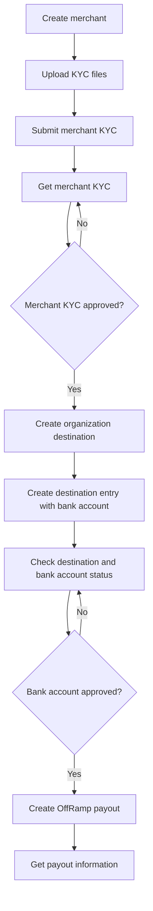

## Overview

Enterprise third-party payouts let a paying enterprise send an OffRamp payout to another enterprise's approved bank account. This workflow is not a single API call. Complete Merchant KYC for the paying enterprise, create and approve an organization Destination and bank account for the receiving enterprise, then create an OffRamp payout.

Use this guide as an end-to-end checklist. For complete request and response schemas, use the linked API reference pages.

## Prerequisites

Before you start, complete the following setup:

- Create API credentials and sign production API requests according to [Authentication](/payments/en/developer-tools/cobo-auth).
- Complete integration testing in the Development environment at `https://api.dev.cobo.com/v2`.
- Use the Production environment at `https://api.cobo.com/v2` only after testing is complete and production access is enabled.
- Make sure enterprise third-party payout capability, Merchant KYC, and OffRamp provider configuration are enabled for your account.

## End-to-end workflow



There are two independent reviews:

- Merchant KYC reviews the paying enterprise.
- Destination Entry review validates the receiving enterprise and its bank account.

Create payouts only after both reviews are approved.

## Create a merchant

Call [Create merchant](/payments/en/api-references/payment/create-merchant) to create the paying enterprise's Merchant.

```bash
curl --request POST \
  --url https://api.dev.cobo.com/v2/payments/merchants \
  --header 'Content-Type: application/json' \
  --header 'BIZ-API-KEY: <your-api-key>' \
  --data '{
    "name": "Merchant A"
  }'
```

Save the returned `merchant_id`. You will use it for Merchant KYC, Destination ownership, and the payout `source_account`.

## Upload merchant KYC files

Call [Upload file](/payments/en/api-references/payment/upload-file) to upload enterprise KYB documents before submitting Merchant KYC. Save each returned `file_id`, then reference those IDs in [Submit merchant KYC](/payments/en/api-references/payment/submit-merchant-kyc).

Common enterprise materials include:

- Certificate of incorporation or business license.
- Business registration or proof of company address.
- Identity documents for directors, UBOs, legal representatives, or authorized persons.
- Proof of address for related natural persons.
- Business proof, platform materials, or other attachments required by the selected `kyc_type`.

Follow the Upload file and Submit merchant KYC schemas for `file_type`, format, size, and required attachment combinations. Do not pass a local file path in a KYC request.

## Submit and review merchant KYC

Call [Submit merchant KYC](/payments/en/api-references/payment/submit-merchant-kyc) for the `merchant_id`. For enterprise third-party payouts, submit the enterprise KYC information required by the online schema.

| Field group | Purpose | Rule |
| --- | --- | --- |
| `merchant_id` | Identifies the Cobo Merchant being reviewed. | Use the value returned by Create merchant. |
| `merchant_type` | Identifies the registered business type. | Use a value supported by the online schema. |
| `kyc_type` | Identifies the enterprise subject type. | Use an enterprise value supported by the online schema. |
| `company_info` | Provides company identity, registration, address, and industry information. | Fill in the required fields for the enterprise subject. |
| `legal_info` | Provides director, UBO, legal representative, or authorized person information. | Fill in the required roles for the subject type. |
| `attachments` | References uploaded supporting files. | Use `file_id` values returned by Upload file. |

Assemble the request according to the conditional required fields in the online Submit merchant KYC schema. Do not mix enterprise and individual KYC schemas in the same submission.

Call [Get merchant KYC](/payments/en/api-references/payment/get-merchant-kyc) until the review result allows payouts. A successfully created Merchant does not mean Merchant KYC is approved.

## Create an organization destination

Call [Create destination](/payments/en/api-references/payment/create-destination) to create the receiving enterprise as an organization Destination.

```bash
curl --request POST \
  --url https://api.dev.cobo.com/v2/payments/destination \
  --header 'Content-Type: application/json' \
  --header 'BIZ-API-KEY: <your-api-key>' \
  --data '{
    "destination_name": "ABC Trading Limited",
    "destination_type": "Organization",
    "merchant_id": "M1001",
    "country": "USA",
    "email": "finance@example.com",
    "contact_address": "123 Main Street, New York, USA"
  }'
```

Use `destination_type` = `Organization` for enterprise payees. Set `country` to an ISO 3166-1 alpha-3 country code, such as `USA` or `HKG`. Save the returned `destination_id`.

## Add a bank account

Call [Create destination entry](/payments/en/api-references/payment/create-destination-entry) to add the receiving enterprise's bank account to the Destination.

```bash
curl --request POST \
  --url https://api.dev.cobo.com/v2/payments/destination_entry \
  --header 'Content-Type: application/json' \
  --header 'BIZ-API-KEY: <your-api-key>' \
  --data '{
    "destination_id": "<destination_id>",
    "bank_accounts": [
      {
        "account_alias": "Main USD Account",
        "account_number": "123456789",
        "currency": "USD",
        "beneficiary_name": "ABC Trading Limited",
        "beneficiary_address": "123 Main Street, New York, USA",
        "bank_name": "Example Bank",
        "bank_address": "New York, USA",
        "swift_code": "BOFAUS33"
      }
    ]
  }'
```

Use a `beneficiary_name` that matches the receiving enterprise's legal name. For USD SWIFT transfers, the bank account usually needs an account number, bank name, SWIFT/BIC, and bank address. Follow the online schema and bank routing requirements for IBAN, local routing, intermediary bank, or further credit fields.

Save the returned `bank_account_id` and monitor `bank_account_status`.

## Verify destination and bank account readiness

Before creating the payout, call [Get destination information](/payments/en/api-references/payment/get-destination-information), [List destination entries](/payments/en/api-references/payment/list-destination-entries), or [Get destination entry information](/payments/en/api-references/payment/get-destination-entry-information) and confirm:

- Merchant KYC is approved.
- `destination_type` is `Organization`.
- `bank_account_id` exists and its status allows payouts.
- The payout fiat `currency` matches the bank account currency.
- The Destination belongs to the paying `merchant_id`.

Destination creation alone does not mean the bank account is ready for payouts.

## Create an OffRamp payout

Call [Create payout](/payments/en/api-references/payment/create-payout) with `payout_channel` = `OffRamp`.

```bash
curl --request POST \
  --url https://api.dev.cobo.com/v2/payments/payouts \
  --header 'Content-Type: application/json' \
  --header 'BIZ-API-KEY: <your-api-key>' \
  --data '{
    "request_id": "merchant-a-payout-20260729-0001",
    "source_account": "M1001",
    "payout_channel": "OffRamp",
    "payout_params": [
      {
        "token_id": "ETH_USDT",
        "amount": "500.00"
      }
    ],
    "recipient_info": {
      "currency": "USD",
      "bank_account_id": "<bank_account_id>",
      "transfer_via_va": false
    },
    "remark": "Supplier payment"
  }'
```

| Field | Meaning | Rule |
| --- | --- | --- |
| `request_id` | Your unique business request ID for idempotency. | Reuse the same value when retrying the same business request. Use a new value for a different payout. |
| `source_account` | Account debited for the payout. | Use the approved paying enterprise's `merchant_id`. |
| `payout_channel` | Payout channel. | Set to `OffRamp` for fiat off-ramp payouts. |
| `payout_params` | Crypto asset deducted for the payout. | Pass `token_id` and `amount`. |
| `recipient_info.currency` | Fiat currency received by the bank account. | Use the currency supported by the approved bank account, such as `USD`. |
| `recipient_info.bank_account_id` | Receiving enterprise bank account. | Use an approved enterprise `bank_account_id`. |
| `transfer_via_va` | Whether the payout routes through a virtual account before bank transfer. | Set to `false` for direct bank account payouts. |

`request_id` is your idempotency key. For the same business request, do not generate a new `request_id` during retries.

## Query payout status

Use the `payout_id` returned by Create payout to call [Get payout information](/payments/en/api-references/payment/get-payout-information).

```http
GET /payments/payouts/{payout_id}
```

For generic payout execution, status meanings, webhook updates, and list queries, see [Off-ramp](/payments/en/guides/fiat-payouts) and [Status and events](/payments/en/guides/status-and-events).

## Troubleshooting

| Issue | Check |
| --- | --- |
| Merchant KYC is not approved. | Call Get merchant KYC. Do not rely only on whether the Merchant exists. |
| Receiving bank account is not approved. | Query the Destination or Destination Entry and check `bank_account_status`. |
| `source_account` is incorrect. | Use the `merchant_id` that completed Merchant KYC. |
| `bank_account_id` does not belong to the business subject. | Check the relationship between the Destination and `merchant_id`. |
| Bank fields are incomplete. | Complete the fields required by country, currency, SWIFT, IBAN, or local routing rules. |
| `request_id` is duplicated or misused. | Reuse the original `request_id` only for the same business request. Use a new value for a different business request. |
| `transfer_via_va` is incorrect. | Set it to `false` for direct bank account payouts. |
| Balance or currency is insufficient or unsupported. | Confirm the available balance of `source_account`, the `token_id`, and the target fiat currency support. |

## Related guides

- [Merchant management](/payments/en/guides/merchants)
- [Destinations](/payments/en/guides/destinations)
- [Off-ramp](/payments/en/guides/fiat-payouts)
- [Integration guide](/payments/en/guides/quick-start)
- [API Playground](/payments/en/api-references/playground)
